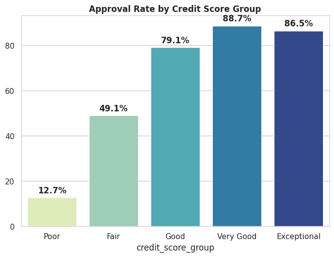
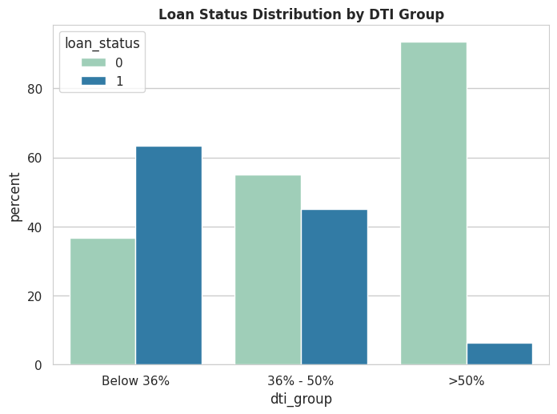
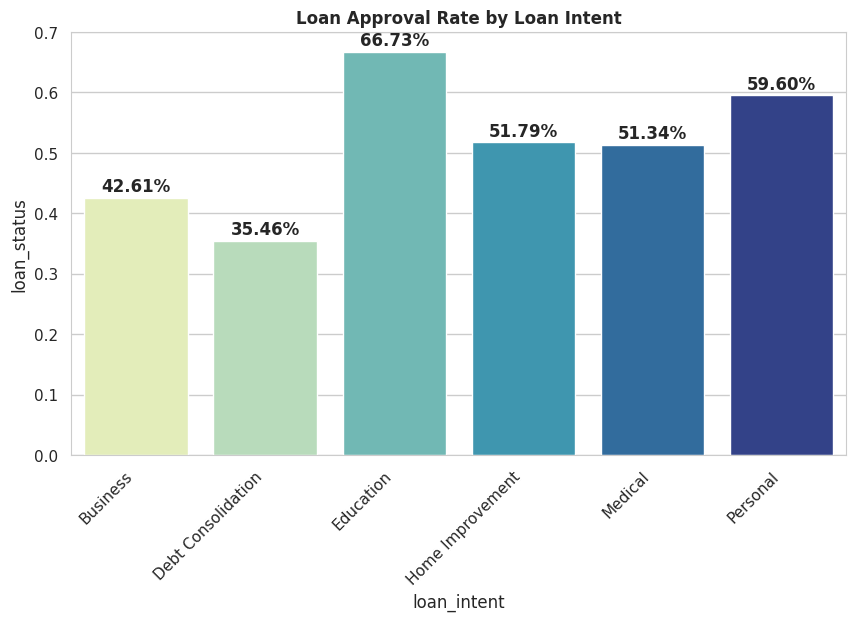

# Loan credit risk analysis

## Overview

This project analyzes 50,000 loan applications from the US and Canada to identify the key factors influencing loan approval decisions and credit risk.

## Business problem

Banks must evaluate borrower reliability, repayment capacity, and loan purpose to make approval decisions while controlling credit risk and maintaining profitability.

## Objectives

* Identify characteristics of rejected loan applications
* Analyze the impact of credit score and debt-to-income ratio (DTI)
* Evaluate lending strategies across different loan purposes
* Generate business insights for credit risk management

## Dataset

Source: Kaggle – Realistic Loan Approval Dataset (US & Canada)

https://www.kaggle.com/datasets/parthpatel2130/realistic-loan-approval-dataset-us-and-canada

## Methodology

* Data cleaning and preprocessing
* Outlier treatment using a Six Sigma approach
* Credit score categorization
* DTI categorization
* Exploratory data analysis (EDA)
* Loan approval analysis
* Lending strategy analysis

## Key findings

* Credit score is the strongest predictor of loan approval.
* DTI below 36% significantly increases approval probability.
* Violation history dramatically reduces approval chances.
* Education loans receive consistently higher approval rates than business loans.

## Tools

Python • Pandas • NumPy • Matplotlib • Seaborn • Jupyter Notebook

## Repository structure

* `notebooks/` – analysis notebook
* `images/` – project visualizations
* `report/` – final analytical report
* `data/` – dataset reference

## Sample visualizations

### Loan approval rate by credit score

### Loan approval rate by debt-to-income ratio

### Loan approval by loan purpose

